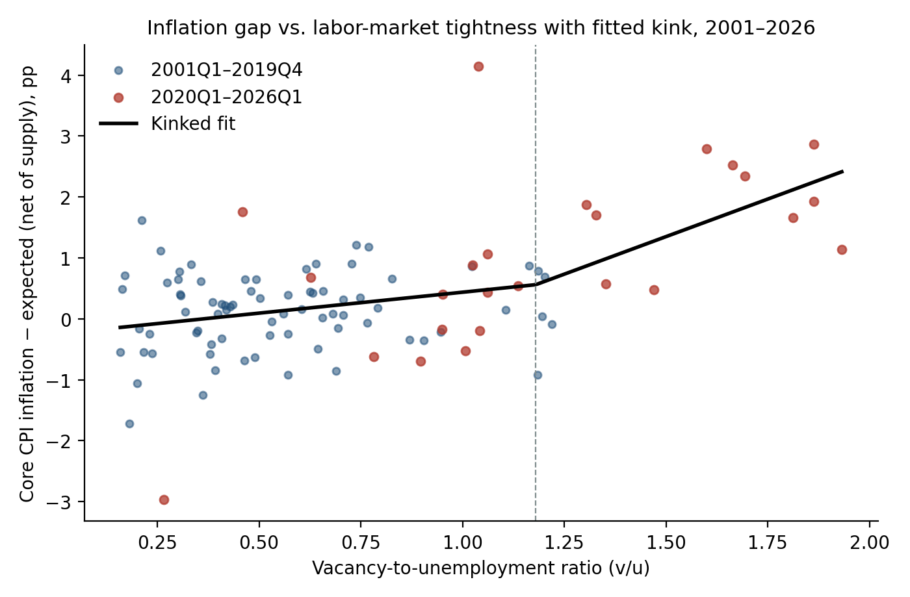

# Nonlinear Phillips Curve Analysis

An empirical study of U.S. inflation and labor-market tightness through 2026Q1.
The Python pipeline compares linear and kinked Phillips curves, estimates
rolling slopes and structural changes, and evaluates conditional projections
on a chronological holdout sample.

The hypothesis tested is that inflation responds more strongly to
labor-market tightness when the vacancy-to-unemployment ratio is high, so the
curve that looked flat before 2020 is nonlinear rather than absent.



## Results

The saved results use a June 12, 2026 data vintage recorded with the original
local inputs. The long sample begins in 1960; the vacancy-based models
use 101 quarters from 2001Q1 to 2026Q1.

| Comparison | Saved estimate |
| --- | --- |
| Unemployment-gap slope, 1960–1989 vs. 1990–2019 | −0.5554 vs. −0.0011 |
| Quandt–Andrews slope-break date, 1960–2019 | 1983Q2; sup-Wald 16.21 vs. 1% critical value 12.35 |
| Linear vacancy/unemployment slope, 2001–2026 | 1.106 (t = 4.15) |
| Estimated vacancy/unemployment kink | 1.18; the approximate LR search set spans the whole 0.40–1.40 grid |
| Slope above / slope below the kink | 3.59 |
| Bootstrap test of linearity | p = 0.2084; linearity is not rejected |
| Holdout RMSE, trained through 2022Q4 (2023Q1–2026Q1), linear vs. kinked | 0.883 vs. 0.795 percentage points |
| Holdout RMSE, trained through 2019Q4 (2020Q1–2026Q1), linear vs. kinked | 1.808 vs. 1.814; the trained kink sits at the 0.40 grid edge |

Both holdout comparisons re-estimate each model, including the threshold, on
the training quarters only, then project with realized expectations,
vacancies, unemployment, and supply pressure. These are conditional
projections using revised data, not real-time forecasts, and no test of
forecast superiority is implemented. Trained through 2022Q4, the kinked
model's RMSE over the 13 quarters from 2023Q1 to 2026Q1 is roughly 10% lower;
that difference is descriptive. Trained only on pre-2020 data, neither model
anticipates the 2021–2022 surge: from 2021Q2 to 2022Q4 both under-project
inflation by roughly 1.4 to 5 percentage points a quarter, and their RMSEs are
nearly equal.

In the fitted decomposition, cooling labor-market tightness accounts for
roughly 63% of the inflation decline between the 2022Q2–Q4 and
2025Q1–2026Q1 averages. This is model-based accounting, not a causal estimate.
Expectations proxies materially affect the estimated curve shape.

See [model estimates](results/results.json),
[decomposition](results/decomposition.csv), and
[holdout comparison](figures/fig7_oos.png).

## Run

Use Python 3.11. From this directory:

```sh
python3.11 -m venv .venv
. .venv/bin/activate
python -m pip install -r requirements.txt
python -m unittest discover -s tests -v
python code/04_tables.py
```

The tests and table generation work offline with the bundled results. Tests
use synthetic data to check quarterly transformations and validate accounting
and holdout metrics. On Windows, activate with `.venv\Scripts\activate`.

For estimation and figure regeneration, obtain the source inputs first:

```sh
python code/00_fetch_data.py
sh code/run_all.sh
```

The downloader obtains the current source vintage and skips existing input
files. Use `--force` only when deliberately refreshing them. Downloads and
processed datasets are local and ignored by Git. Network access is needed
for downloading; no API key is required.

The full pipeline has been checked against the original local inputs and
reproduces the saved estimates. Live acquisition was checked for UNRATE and
GSCPI; the offline tests cover input parsing and failed-download handling.

New downloads may revise historical values, so a fresh run can differ from
the bundled results. Exact numerical replication requires the original input
vintage, which is not included. The analysis end date stays fixed at 2026Q1;
refreshing inputs does not extend the study. Running the pipeline overwrites
the saved results and figures in the checkout.

The order is `01_build_dataset.py` → `02_analysis.py` → `03_figures.py` →
`04_tables.py`. Each script resolves paths from its own location. On Windows,
run those four scripts with `python` in that order. Estimation includes 499
bootstrap replications and can take a few minutes.

### Offline demo on synthetic data

To run the estimation, figures, and tables without network access, use the
synthetic demo:

```sh
python code/run_demo.py
```

It writes synthetic series in the downloaded-input format to the ignored
`demo/` folder, copies the four pipeline scripts there, and runs them. The
saved results, figures, and any downloaded inputs are not touched. The
synthetic inflation gap has a kink planted at v/u = 1.0, with slopes of 0.5
below and 3.5 above, so the run shows whether the grid search recovers a
known threshold. With the default seed and the pinned packages it estimated
1.14, and the approximate LR search set (0.92–1.40) contained the planted
value. Figure and table titles still describe the U.S. study, but every
number in `demo/` is synthetic. Use `--prepare-only` to write the inputs
without estimating, and `--seed` to draw a different sample. The demo takes
under a minute.

## Data and method

| Input group | FRED series |
| --- | --- |
| Price indices | CPIAUCSL, CPILFESL, PCEPILFE, PCEPI, CPIENGSL |
| Labor market | UNRATE, NROU, JTSJOL, UNEMPLOY |
| Inflation expectations | MICH, EXPINF1YR, EXPINF10YR |
| Recession shading | USREC |

Series are downloaded from FRED's CSV endpoint and retain their source
identifiers. The [Michigan expectations series](https://fred.stlouisfed.org/series/MICH)
is attributed to Surveys of Consumers, University of Michigan, via FRED.
The [Global Supply Chain Pressure Index](https://www.newyorkfed.org/research/policy/gscpi)
comes from the Federal Reserve Bank of New York. Download provenance records
the URLs, retrieval time, and file checksums locally. Consult each source for
its usage terms.

Monthly observations are averaged within calendar quarters. Inflation is
`400 × log(Pq / Pq−1)` for quarterly annualized rates and
`100 × log(Pq / Pq−4)` for year-over-year rates. The unemployment gap is
UNRATE minus NROU; tightness is JTSJOL divided by UNEMPLOY. Relative energy
inflation subtracts **core CPI** inflation from energy CPI inflation. Adaptive
expectations use only the preceding four quarters.

The regression pipeline uses OLS with Newey–West standard errors (four lags),
60-quarter rolling windows, a slope-break scan, and a kink search over
vacancy/unemployment ratios from 0.40 to 1.40. Thresholds in the holdout
comparison are selected from training observations only.

Inference is exploratory. The moving-block bootstrap uses eight-quarter
blocks, seed 42, and a coarser threshold grid than the observed statistic.
The stored `c_ci95` bounds are an approximate LR search set: the borrowed
threshold cutoff has not been calibrated for this continuous-kink model.
Reported slope standard errors condition on the selected threshold. The
results do not establish a nonlinear Phillips curve or causal effects.

## Files

- `code/`: data acquisition, transformations, estimation, figures, tables,
  and the synthetic demo (`run_demo.py`).
- `results/`: aggregate estimates and supporting CSV outputs; unavailable
  statistics are represented by JSON `null`.
- `figures/`: seven research figures.
- `tests/`: offline checks using synthetic inputs and saved outputs.

Raw inputs and processed datasets are not bundled; the demo generates
synthetic stand-ins locally. Generated Markdown tables are saved to the
ignored `tables/` folder.
